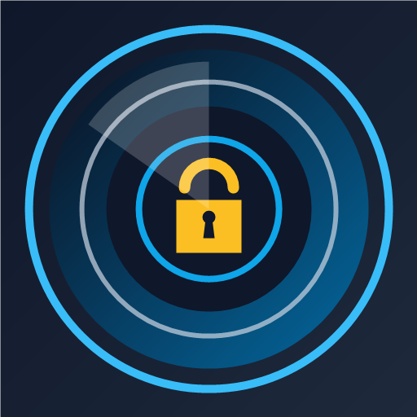
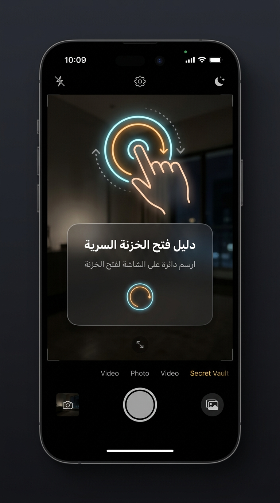

# 📷 خزنة الكاميرا السرية | Camera Vault (HD Camouflage & AES-256-GCM)

<div align="center">



### تطبيق أندرويد لحفظ وتشفير الصور والفيديوهات والملفات بسرية تامة مع تمويه احترافي على شكل كاميرا عالية الدقة 📸
**Military-Grade Encrypted Vault disguised as a fully functional HD Camera**

[](https://github.com/dev-huthaifa/CameraVault/releases/latest)
[](https://github.com/dev-huthaifa/CameraVault/releases)
[](LICENSE)
[](https://github.com/dev-huthaifa)

---

[📥 **اضغط هنا لتحميل ملف التطبيق الجاهز (Download Signed APK)**](https://github.com/dev-huthaifa/CameraVault/releases/latest/download/CameraVault_v1.0_Signed.apk)

</div>

---

## 📖 نظرة عامة (Overview)

تطبيق **خزنة الكاميرا (Camera Vault)** هو الحل الأمني المتكامل لحماية خصوصيتك وصورك وفيديوهاتك ومستنداتك الحساسة. لا يظهر التطبيق في هاتفك كخزنة تقليدية، بل يظهر كـ **كاميرا HD عادية تماماً** تفتح وتلتقط الصور وتحفظها في المعرض بدون إثارة أي شك. 

لا يمكن فتح الخزنة السرية الحقيقية إلا من خلال **إيماءة سرية مخصصة (رسم دائرة ⭕ على الشاشة أو 3 نقرات سريعة)** متبوعة برمز PIN المشفر.

<div align="center">

</div>

---

## ✨ المميزات الفائقة (Key Features)

### 1. 🎭 التمويه المزدوج الذكي (True Camera Camouflage)
* **اسم وأيقونة الكاميرا:** يظهر على الشاشة الرئيسية باسم **"الكاميرا HD"** مع أيقونة كاميرا حديثة.
* **واجهة كاميرا كاملة ومفتوحة:** عند تشغيل التطبيق، تفتح كاميرا متطورة مبنية بواسطة `Android CameraX` مع فلاش، تبديل العدسات، وزر التقاط يحفظ الصور فعلياً في معرض الهاتف العام (`DCIM/Camera`).

### 2. ⭕ إيماءة الفتح السرية (Secret Trigger Gesture)
* يمكنك فتح شاشة الخزنة السرية في أي لحظة عبر:
  1. **رسم حلقة أو دائرة مغلقة ⭕** بإصبعك على شاشة الكاميرا في أي مكان.
  2. **ثلاث أو أربع نقرات سريعة 👆** متتالية على الشاشة.
  3. **ضغطة مطولة على شارة الجودة (4K • 60FPS)** في الشريط العلوي كخيار طوارئ بديل.
* اهتزاز تفاعلي خفيف (Haptic Feedback) يؤكد التعرف على الحركة دون إظهار أي أثر على الشاشة.

### 3. 🛡️ تشفير عسكري واختفاء حقيقي (AES-256-GCM)
* **تشفير محلي فائق:** تشفير عسكري **AES-256-GCM** مع اشتقاق المفاتيح بواسطة **PBKDF2WithHmacSHA256** (10,000 دورة + Salt عشوائي 128-bit + IV فريد لكل ملف).
* **حذف واختفاء فوري:** بمجرد استيراد الصورة أو الفيديو، يتم مسح الملف الأصلي نهائياً من المعرض ومدير الملفات ويختفي من النظام كلياً عبر `MediaScannerConnection`.
* **فك التشفير عند الاستعادة:** يمكنك إعادة أي ملف إلى المعرض في أي وقت بنفس جودته الأصلية.

### 4. 🗂️ تصنيفات وإدارة متقدمة (Organized Vault)
* دعم كامل لجميع أنواع الوسائط:
  * 🖼️ **الصور (Photos)**
  * 🎬 **الفيديوهات (Videos)**
  * 📄 **المستندات والملفات (Documents: PDF, Word, Excel, إلخ)**
  * 🎵 **الصوتيات (Audio)**
* **معاينة سرية داخل الذاكرة (In-Memory Decryption):** عرض الصور وتشغيل الفيديو داخل التطبيق بأمان تام دون كتابة أي ملف غير مشفر على قرص التخزين.
* **التصوير السري المباشر:** التقاط صور من داخل الخزنة تُحفظ مشفرة فوراً دون المرور على المعرض إطلاقاً.

### 5. 🕵️ مكافحة التجسس والحماية الصارمة (Anti-Spy Security)
* **حظر تصوير الشاشة (`FLAG_SECURE`):** منع لقطات الشاشة أو تسجيل الفيديو داخل الخزنة، وإخفاء الشاشة من قائمة التطبيقات الحديثة (Recent Apps).
* **الخزنة الوهمية (Decoy Vault):** رمز حماية إضافي بديل؛ في حال أُجبرت على فتح الخزنة، أدخل هذا الرمز ليفتح خزنة فارغة تماماً دون كشف ملفاتك الحقيقية.
* **سيلفي المتطفل (Intruder Selfie):** التقاط صورة سرية وفورية بالكاميرا الأمامية لأي شخص يحاول إدخال رمز خاطئ 3 مرات، مع تسجيل تاريخ ووقت المحاولة بدقة.
* **الفتح بالبصمة (Biometric Login):** دعم بصمة الإصبع والوجه للأجهزة المتوافقة.

---

## 📥 التحميل والتثبيت (Downloads)

يمكنك تحميل النسخة الجاهزة للتثبيت المباشر بصيغة APK من قسم الإصدارات:

| الملف | النوع | الوصف | رابط التحميل |
| :--- | :--- | :--- | :--- |
| **`CameraVault_v1.0_Signed.apk`** | Release APK | النسخة الرسمية الموقعة والنهائية مع كامل معايير الأمان وتشفير الشاشة. | [📥 تحميل مباشر](https://github.com/dev-huthaifa/CameraVault/releases/latest/download/CameraVault_v1.0_Signed.apk) |
| **`CameraVault_Screenshots_Edition.apk`** | Showcase APK | نسخة بدون قيود أمان لقطات الشاشة لتصوير الواجهات ومشاركتها في المتاجر. | [📥 تحميل مباشر](https://github.com/dev-huthaifa/CameraVault/releases/latest/download/CameraVault_Screenshots_Edition.apk) |
| **`CameraVault_v1.0_Signed.aab`** | App Bundle | الحزمة الرسمية الجاهزة للرفع على Google Play Console. | [📥 تحميل الحزمة](https://github.com/dev-huthaifa/CameraVault/releases/latest/download/CameraVault_v1.0_Signed.aab) |

---

## 🧪 ملاحظات لفريق مراجعة المتاجر (Store Reviewers Notes)

> [!NOTE]
> **Instructions for App Store Reviewers (Uptodown, Google Play, Huawei AppGallery):**
> 
> * **Nature of the App:** This application is a privacy disguise vault. Upon launching, it intentionally presents a functional HD Camera interface to protect user privacy.
> * **How to Access the Hidden Vault:**
>   1. Draw a circle ⭕ anywhere on the camera viewfinder, or tap rapidly 3-4 times.
>   2. The secret PIN keypad will appear.
>   3. Set up a 4-digit master PIN (e.g. `1234`) and confirm it to access the full encrypted vault.
> * **Privacy Compliance:** All media encryption is 100% offline and local on the user's device. For our complete policy, please see [PRIVACY_POLICY.md](PRIVACY_POLICY.md).

---

## 🛠️ متطلبات البناء والتطوير (Building from Source)

1. استنسخ المستودع:
   ```bash
   git clone https://github.com/dev-huthaifa/CameraVault.git
   cd CameraVault
   ```
2. افتح المشروع في **Android Studio** (نسخة Ladybug أو أحدث).
3. المتطلبات التقنية:
   * **JDK:** OpenJDK 17
   * **Android SDK:** Compile SDK 34 (Android 14) / Min SDK 24 (Android 7.0)
   * **Build System:** Gradle 8.9 + Kotlin 1.9.24
4. للبناء عبر سطر الأوامر:
   ```bash
   ./gradlew assembleRelease
   ```

---

## 📄 سياسة الخصوصية (Privacy Policy)

تطبيق **Camera Vault** يحترم خصوصيتك بالكامل، ويعمل بنظام **Off-grid / Offline-First** بدون أي خوادم خارجية لحفظ أو مزامنة صورك. للاطلاع على سياسة الخصوصية الكاملة:
* [عرض سياسة الخصوصية الرسمية (Privacy Policy)](PRIVACY_POLICY.md)

---

## 👨‍💻 المطور (Developer)

* **المهندس:** Eng. Huthaifa Aref (`dev-huthaifa`)
* **البريد الإلكتروني:** [eng.huthaifa.aref.1611@gmail.com](mailto:eng.huthaifa.aref.1611@gmail.com)
* **GitHub Profile:** [@dev-huthaifa](https://github.com/dev-huthaifa)

---

<div align="center">
<b>All Rights Reserved © 2026 Eng. Huthaifa Aref</b>
</div>
